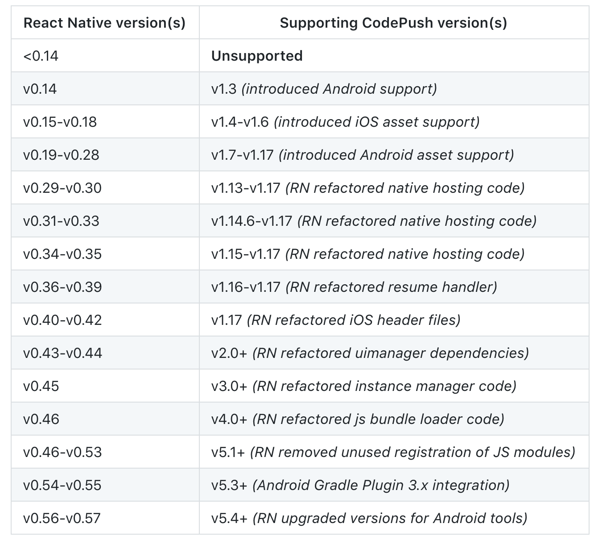

# CodePush
> 为用ReactNative构建的项目，提供热更新的能力。在无需客户端发版的情况下，进行版本升级、bug修复。
> 
> 建议:bug修复、小版本迭代使用CodePush。大版本更新还是使用平台发布。


##支持的RN平台
- iOS(7+)
- Android(4.1+)




### 1.安装CodePush CLI
> 只需全局安装一次即可。

```npm install -g code-push-cli```

###2.注册CodePush账号
```code-push register```  
浏览器会打开一个授权页面，选择一个授权方式即可。当注册成功后，CodePush会给我们一个key。直接赋值这个key，粘贴在终端的相应未知。 
***
```code-push login```
登录命令。也可用来验证登录是否成功。  
如果登录成功会提示：<font color=red >[Error] You are already logged in from this machine</font>

#####CodePush注册登录相关命令：
+ code-push login     登录
+ code-push logout    注销
+ code-push access-key ls   列出登录的token
+ code-push access-key rm 	 删除某个access-key

###3.在CodePush服务器注册App
> 为了让CodePush服务器有我们的App,我们需要CodePush注册App,输入下面命令即可完成注册,这里需要注意如果我们的应用分为iOS和Android两个平台,这时我们需要分别注册两套key应用添加成功后就会返回对应的`production`和`Staging`两个key,`production`代表生产版的热更新部署,`Staging`代表开发版的热更新部署,在iOS中将staging的部署key复制在`info.plist`的`CodePushDeploymentKey`值中,在android中复制在`Application`的`getPackages`的CodePush中。  

+ 添加iOS平台应用
  `$ code-push app add <AppName> ios react-native`
+ 添加Android平台应用
  `$ code-push app add <AppName> Android react-native`

#####CodePush管理App的相关命令
+ code-push app add  在账号里面添加一个新的app
+ code-push app remove 或者 rm在账号里移除一个app
+ code-push app rename 重命名一个存在app
+ code-push app list 或ls 列出账号下面的所有app
+ code-push app transfer 把app的所有权转移到另外一个账号

###4.RN代码中集成CodePush
+ 安装组件
	+ ```$ npm install react-native-code-push --save```
+ 添加原生依赖,这里添加依赖我们使用自动添加依赖的方法
	+ ```$ npm link react-native-code-push```

###5.RN更新
##### 更新机制   
     Mandatory代表是否强制性更新，这个属性只是简单的传递给客户端,具体要对这个属性如何处理是由客户端决定的。也就是说，如果在客户端使用`codePush.sync`时，**updateDialog**为**true**的情况下，如果**-mandatory**为**false**，则更新提示框会弹出两个按钮，一个是【确认更新】，一个是【取消更新】，但是在**-mandatory**为**true**的情况下就只有一个按钮【确认更新】用户没法拒绝安装这个更新。**在updateDialog为false的情况下，-mandatory 就不起作用了，因为都会静默更新。**    
> 注意：mandatory是服务器传给客户端的,它是一个“动态”属性,意思是当你正在使用版本**v1**的更新,然后现在服务器上有**v2**和**v3**的更新可用。v2的配置为强制更新，v3是非强制更新。则v1直接升级到v3也为强制更新。v2升级到v3为非强制更新。
    
##### 更新时机	
> 一般常见的应用内更新时机分为两种,一种是打开App就检查更新，一种是由用户主动触发更新并安装。例如：检查更新功能

###### 打开App就检查更新
```/**
 * Sample React Native App
 * https://github.com/facebook/react-native
 * @flow
 */

import React, { Component } from 'react';
import {
  Platform,
  StyleSheet,
  Text,
  View
} from 'react-native';

import CodePush from "react-native-code-push"; //引入code-push

let codePushOptions = {
  //设置检查更新的频率
  //ON_APP_RESUME APP恢复到前台的时候
  //ON_APP_START APP开启的时候
  //MANUAL 手动检查
  checkFrequency : CodePush.CheckFrequency.ON_APP_RESUME
};

const instructions = Platform.select({
  ios: 'Press Cmd+R to reload,\n' +
    'Cmd+D or shake for dev menu',
  android: 'Double tap R on your keyboard to reload,\n' +
    'Shake or press menu button for dev menu',
});

type Props = {};

class App extends Component<Props> {

  //如果有更新的提示
  syncImmediate() {
    CodePush.sync( {
          //安装模式
          //ON_NEXT_RESUME 下次恢复到前台时
          //ON_NEXT_RESTART 下一次重启时
          //IMMEDIATE 马上更新
          installMode : CodePush.InstallMode.IMMEDIATE ,
          //对话框
          updateDialog : {
            //是否显示更新描述
            appendReleaseDescription : true ,
            //更新描述的前缀。 默认为"Description"
            descriptionPrefix : "更新内容：" ,
            //强制更新按钮文字，默认为continue
            mandatoryContinueButtonLabel : "立即更新" ,
            //强制更新时的信息. 默认为"An update is available that must be installed."
            mandatoryUpdateMessage : "必须更新后才能使用" ,
            //非强制更新时，按钮文字,默认为"ignore"
            optionalIgnoreButtonLabel : '稍后' ,
            //非强制更新时，确认按钮文字. 默认为"Install"
            optionalInstallButtonLabel : '后台更新' ,
            //非强制更新时，检查到更新的消息文本
            optionalUpdateMessage : '有新版本了，是否更新？' ,
            //Alert窗口的标题
            title : '更新提示'
          } ,
        } ,
    );
  }

  componentWillMount() {
    CodePush.disallowRestart();//页禁止重启
    this.syncImmediate(); //开始检查更新
  }

  componentDidMount() {
    CodePush.allowRestart();//在加载完了，允许重启
  }

  render() {
    return (
      <View style={styles.container}>
        <Text style={styles.welcome}>
          Welcome to React Native!
        </Text>
        <Text style={styles.instructions}>
          To get started, edit App.js
        </Text>
        <Text style={styles.instructions}>
          {instructions}
        </Text>

        <Text style={styles.instructions}>
          这是更新的版本
        </Text>
      </View>
    );
  }
}

//这一行是必须的
App = CodePush( codePushOptions )( App );
export default App;

const styles = StyleSheet.create({
  container: {
    flex: 1,
    justifyContent: 'center',
    alignItems: 'center',
    backgroundColor: '#F5FCFF',
  },
  welcome: {
    fontSize: 20,
    textAlign: 'center',
    margin: 10,
  },
  instructions: {
    textAlign: 'center',
    color: '#333333',
    marginBottom: 5,
  },
});
```
 
###### 用户点击检查更新按钮
```import React, { Component } from "react";
import {
  StyleSheet,
  Text,
  Button,
  View,
  FlatList,
  Alert,
  TouchableOpacity
} from "react-native";

import CodePush from "react-native-code-push";

let codePushOptions = {
  //设置检查更新的频率
  //ON_APP_RESUME APP恢复到前台的时候
  //ON_APP_START APP开启的时候
  //MANUAL 手动检查
  checkFrequency: CodePush.CheckFrequency.ON_APP_RESUME
};

class HomeScreen extends Component {
  componentWillMount() {}

  componentDidMount() {}

  static navigationOptions = {
    title: "首页",
    headerStyle: { backgroundColor: "#f4511e" }
  };

  constructor(props) {
    super(props);
    this.state = {
      list: [
        "LinearGradient",
        "QRCode",
        "DeviceInfo",
        "ImagePicker",
        "ImagePicker2",
        "QRScanner"
      ]
    };
  }

  render() {
    return (
      <View style={styles.wrapper}>
        <FlatList
          style={{ width: "100%" }}
          contentContainerStyle={{ backgroundColor: "green" }}
          data={this.state.list}
          keyExtractor={(item, index) => index.toString()}
          renderItem={({ item }) => (
            <TouchableOpacity
              style={{
                height: 36,
                marginRight: 0,
                marginLeft: 0,
                justifyContent: "center",
                borderBottomWidth: 1,
                borderBottomColor: "#EBEEEF"
              }}
              activeOpacity={1}
              onPress={() => {
                this.props.navigation.push(item);
              }}
            >
              <Text>{item}</Text>
            </TouchableOpacity>
          )}
        />
        <Button title="检查更新" onPress={() => this.update()} />
      </View>
    );
  }

  update() {
    let deploymentKey =
    "gznakSDQMAWZMGj2Cdv875OuRQp-16019a3c-6414-4755-9fda-175132ca846e";
    CodePush.checkForUpdate(deploymentKey).then(update => {
      if (!update) {
        Alert.alert("提示", "已是最新版本--", [
          {
            text: "Ok",
            onPress: () => {
              console.log("点了OK");
            }
          }
        ]);
      } else {
        CodePush.sync(
          {
            deploymentKey: deploymentKey,
            updateDialog: {
              optionalIgnoreButtonLabel: "稍后",
              optionalInstallButtonLabel: "立即更新",
              optionalUpdateMessage: "有新版本了，是否更新？",
              title: "更新提示"
            },
            installMode: CodePush.InstallMode.IMMEDIATE
          },
          status => {
            switch (status) {
              case CodePush.SyncStatus.DOWNLOADING_PACKAGE:
                console.log("DOWNLOADING_PACKAGE");
                break;
              case CodePush.SyncStatus.INSTALLING_UPDATE:
                console.log(" INSTALLING_UPDATE");
                break;
            }
          },
          progress => {
            console.log(
              progress.receivedBytes +
                " of " +
                progress.totalBytes +
                " received."
            );
          }
        );
      }
    });
  }
}

HomeScreen = CodePush(codePushOptions)(HomeScreen);
export default HomeScreen;

const styles = StyleSheet.create({
  wrapper: {
    flex: 1,
    alignItems: "center",
    justifyContent: "center"
  }
});
```

### 上传bundle
```$ code-push release-react <Appname> <Platform> --t <本更新包面向的旧版本号> --des <本次更新说明>```
> 注意：CodePush默认是更新Staging环境的,如果发布生产环境的更新包,需要制定--d 参数：--d Production，如果发布的是强制更新包，需要在加上 --m true强制更新。

```$ code-push release-react iOSRNHybrid ios --t 1.0.0 --dev false --d Production --des "这是第一个更新包" --m true```


### 其他命令
######查看发布的历史记录
```$ code-push deployment history ProjName Staging```
