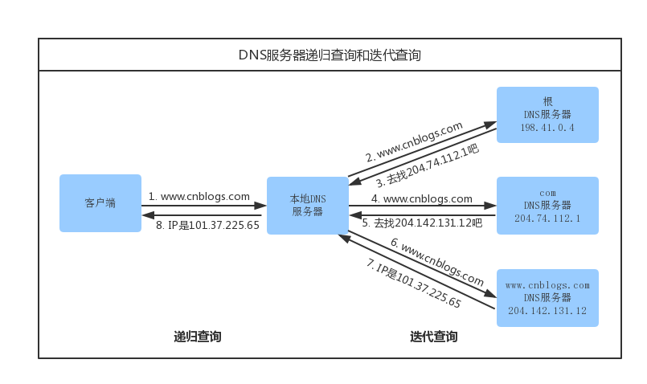

# 浏览器输入URL后发生了什么

## 内容目录
1. DNS域名解析
2. 建立TCP连接
3. 发送HTTP请求
4. 服务器处理请求
5. 返回响应结果
6. 关闭TCP连接
7. [浏览器解析HTML](#浏览器解析HTML)
8. 浏览器布局渲染

## DNS域名解析
我们在浏览器输入网址，其实就是向服务器请求我们想要的页面内容，所以浏览器需要根据域名找到对应的服务器IP地址,这样就知道了对应的服务器在哪里。将域名解析成对应的服务器IP地址这项工作,是由DNS服务器来完成的。

客户端收到域名地址后,它首先去找本地的hosts文件，检查在该文件中是否有相应的域名、IP对应关系。如果有，则向其IP地址发送请求;如果没有,再去找DNS服务器。(一般用户很少去编辑修改hosts文件)

1. 浏览器客户端向本地DNS服务器发送一个含有域名 www.cnblogs.com的DNS查询报文。

2. 本地DNS服务器把查询报文转发到根DNS服务器。
3. 根服务器注意到其com后缀,于是本地DNS服务器返回comDNS服务器的IP地址。
4. 本地DNS服务器再次向comDNS服务器发送查询请求。
5. comDNS服务器注意到其www.cnblogs.com后缀并将负责该域名的权限DNS服务器的IP地址作为回应。
6. 本地DNS服务器将查询报文发给www.cnblogs.com DNS服务器
7. www.cnblogs.com DNS服务器将IP返回给本地DNS服务器
8. 本地DNS服务器再将IP返回给客户端

从客户端到本地服务器属于**递归查询**，而DNS服务器之间的交互属于**迭代查询**

正常情况下，本地DNS服务器的缓存中已有comDNS服务器的地址,因此请求根域名服务器这一步不是必需的。

## 浏览器解析HTML
执行以下过程：

准确地说,浏览器需要加载解析的不仅仅是HTML，还包括CSS、JS。以及还要加载图片、视频等其他媒体资源。  

浏览器通过解析HTML，生成DOM树,解析CSS,生成CSS规则树,然后通过DOM树和CSS规则树生成渲染树。渲染树与DOM树不同,渲染树中并没有head、display为none等不必显示的节点。

要注意的是,浏览器的解析过程并非是串联进行的。比如在解析CSS的同时,可以继续加载解析HTML,但在解析执行JS脚本时,会停止解析后续HTML,这就会出现阻塞问题。

参考：

+ [浏览器输入URL后发生了什么](http://www.xuecaijie.com/it/157.html#1Q64p5DeC8dKFF)

+ [十分钟读懂浏览器渲染流程](http://www.xuecaijie.com/htmlcss/172.html)